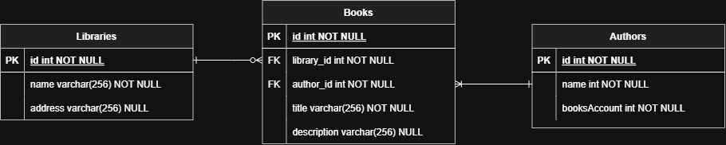
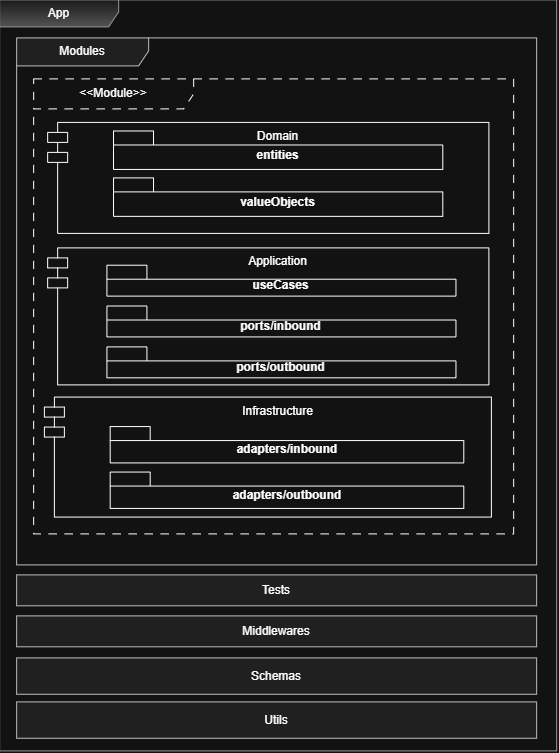
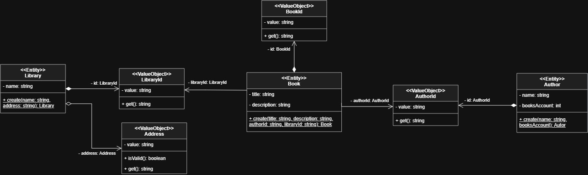
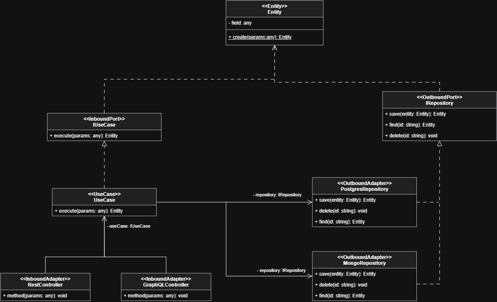

# nest-hexagonal — pure hexagonal implementation

> This explanation about the architecture is the same as described in the main branch — if you've already read it, you can skip ahead to the [Design Process](#design-process) section, where we'll talk about the specific implementation of this branch.

This repo is a pure implementation of a **hexagonal architecture**, following the standards and principles of **clean code**. The main purpose of this repository is to work as a template of a hexagonal implementation and to guide people through hexagonal concepts.

Following the documentation and the different theoretical approaches out there, it's easy to get confused, because hexagonal architecture breaks with many traditional architectures and concepts.

The repo is going to be branched into two initial implementations:

- **stable/monolith**: this branch will be a complete end-to-end (E2E) design of an example service connected to a Postgres DB.
- **stable/microservice**: this will be an implementation of three different microservices, each one following the hexagonal definition, using the same example as the monolith implementation.

---

## Technology

I decided to use **Nest** with **TypeScript** as the framework for this implementation, because Node is my main stack.

The idea with this repo, though, is to make it **agnostic of the stack selected** — the plan is to allow others to replicate this workflow and build their own implementation with any stack.

Nest offers us some tools that can ease our setup, such as:

- Middlewares
- Error handlers
- Dependency injection
- DB/ORM integrations

These help us manage all the setup required to develop a working application.

As I mentioned before, this is just **sugar** for our application — my focus is going to be inside the **kernel** of any software application (its domain and business rules). All the other parts should be supplied by any framework, ORM, language, and so on.

---

## Literature

First of all, we need to talk about hexagonal architecture, which is a software design that, depending on the author, could be interpreted and implemented in different ways.

This is my own representation based on many different documents — if you want to dive deeper into this, you can check:

- "Hexagonal Architecture" (alistair.cockburn.us/hexagonal-architecture)
- "Implementing Domain-Driven Design" by Vaughn Vernon (2013)
- "Clean Architecture" by Robert C. Martin (2017) — also known as "Uncle Bob"

> Also, I'm not the source of truth — feel free to read, research, and make your own implementation if you feel the need to.

---

## Architecture

This architecture is commonly represented as a circle of three layers, or wrapped by three different abstraction layers, in this order of importance and dependency:

| Layer | Contains | Responsibility |
| --- | --- | --- |
| **Domain** | Entities, Value Objects | Holds all the important information about the application |
| **Application** | Ports, Use Cases | Stores all the business rules |
| **Infrastructure** | Adapters | Manages all the interactions with external systems |

The main focus of this architecture is to **isolate the domain and business rules from the implementation concepts**, which allows us to grow our application in a very scalable way. If we need to make a change, we can go directly to what's affected and make the change there without affecting the other layers in any way.

We can also change one of the layers completely while preserving the other implementations. For example, imagine you decided to start your project with this implementation, but at some point you realize that TypeScript and Node are not the best framework selection for your project. In a traditional architecture, changing the framework or the language means, basically, redesigning everything.

With this architecture, we just need to migrate the domain and application layers and implement the new infrastructure rules and technologies. That way, we preserve the same initial design and business rules, and we just change how our app uses that kernel. **That's the power of a hexagonal implementation.**

But at the same time, we have some disadvantages: one of them is the complexity of understanding and implementing this kind of architecture. Frequently, the learning curve becomes steep at this point.

### Modules

#### Domain Layer

This is the most important layer in our application. The domain tells us:

- Who the entities involved in our application are
- How they communicate with each other
- How each entity or object is related and structured
- What kind of properties and fields it contains
- Why it's important to sustain that information

Following these requirements, I divided this layer into two sublayers, or subcomponents: **entities** and **value objects**.

The **entity** is the whole object itself — the representation and the means of the system. It contains the fields that represent information about the object.

The **value objects** are more complex fields with some specific characteristics:

- They can be replaced with another one, as long as it has the same data definition
- They cannot be modified after their creation
- They can only be compared by value — the reference of the object is not important at all

The importance of the domain layer is that it allows us to understand how our application is structured, what its purpose is, and its reason for existing — how everything is connected and related, and not just how, but also why it's related in a specific way. Basically, it contains all the important information about our application.

#### Application Layer

The application layer is the next layer that wraps the domain one; its function is to store all the business rules. I decided to divide it into two subsets: **ports** and **use cases**.

**Use cases** contain exactly the kind of operations we can execute over our domain — the domain is the structure, and the use cases work as its functionality: what I'm allowed to execute. They contain exactly the rules that our business requires for our system.

**Ports**, on the other hand, are basically interfaces or contracts that tell us how external systems or technologies can communicate with the domain. A port can be either **inbound** or **outbound**.

An example of an outbound port is the interface to interact with the DB or persistence layer. The power of this is that if I follow the same contract to manage specific operations over our domain, I can exchange between different DB engines without touching or changing anything related to the application or domain.

Suppose you decide to use Postgres as your DB engine — there you can find all the important operations over a DB, like read, create, and delete, etc. But at some point your business decides to migrate your data to another engine, maybe they wanted more flexibility, so they decide to migrate to Mongo.

In a traditional architecture, that kind of change would mean touching most of the parts of the application, including business rules (which are frequently coupled to the repositories and their implementations — queries, and things like that). With this architecture, you just need to migrate the data from Postgres to the new engine and adapt the operations to fulfill the contract, or port. That means not changing the domain, the business rules, or anything else — just the implementation itself.

So you can be sure the application will continue working as expected, since nothing related to the business rules changes, and you've successfully migrated your data. **That's the power of this.**

**Inbound ports**, on the other hand, refer to how the operations are executed over our application. Imagine you need to manage an application that requires interoperability — you need to be able to get information into our system through a REST API, gRPC, CLI... and you need to find a way to manage all of those entries; that's why inbound ports exist.

It's the same idea — basically a contract with all the operations allowed to be executed over our system (all the business operations allowed). You just need to ensure the external technologies match that contract, and that's it. You can manage many entries, executing operations over the same core, without touching or changing anything related to the domain (data and class structure) and the business rules (operations).

#### Infrastructure Layer

This is the most external layer of our architecture. It contains all the implementations — basically, its function is to manage the **adapters**.

The adapters are the other side of the coin when it comes to the ports: they're all the specific implementations that fulfill the contract defined by the ports. There we can find specific and directly related implementations, like a Postgres adapter, a Mongo adapter, a REST adapter... and so on.

The main function of this layer is to manage all the interactions with external systems. So, in case we need to change something inside our system related to specific implementations, or we need to migrate our DB engine, or maybe implement different ways to connect with our system — here is the only part we're going to need to change. The other parts of the system are going to preserve their code just like it was defined.

### Generic Modules

At this point, we have solved the main application structure — with this, the system would work completely, flowing from start to end of the app. But we can quickly face a problem: what happens with domains that don't follow a specific shape, or with domains that aren't too transparent, something really specific like a Book or Author entity?

In that case, it's important to ask some questions:

- Is the functionality modelable as an entity?
- Does the functionality contain, or can it be wrapped with, an identity?
- Does the functionality contain variants and business rules?
- Do we need to store the information somewhere in our DB?

If the answer to those questions is yes, it's clear we need to follow the same architecture definition (**domain/application/infrastructure**), because the functionality is still a business part. It's very important to follow good coding principles, understand exactly the responsibility of each part of the architecture, how the different layers communicate, and preserve its extensibility and decoupling.

In any other case, we can just implement the layers we require. For example, if we need to create some functionality to translate PDFs (stateless functionality), we can just create its infrastructure (adapter or external connections) and its application (use case — translate something), so in that case we can ignore the creation of a domain.

### Other Layers

By now, our application is completely designed — all the business capabilities were represented in our system, and we achieved all the business requirements. But we need to get all of this running, and at that moment another kind of question arises to solve.

For example, we might need to create:

- Migrations
- Utils
- Tests
- Middlewares
- Error handlers

All of those are things tied to the implementation (for this case, we are modeling a backend service), so in another case that kind of thing might not be important. But following this project, we need to find a way to organize all of those things, so I decided to create something like a layered architecture wrapping the hexagonal definition.

In that way, I created all of those layers as **transversal layers**, or **shared layers**. These should hold whatever is required for this specific backend service to work.

An important part there is trying not to tie any of the logic located there to any module directly — we aim to create functionalities or logic to manage the service's functionality, and use those tools around the application in general.

## Design Process

Once we've defined the architecture we're going to follow, the next step is how to start interacting with it — how to organize everything, and what kind of process I need to follow for this.

The first part is to design everything. For that, I created an example of a simple library application. Basically, this monolith contains all the APIs required to interact with Books, Authors, and Libraries — the goal of this repo is to illustrate the architecture with a functional example.

I started the process by understanding the business requirements. Our business needed a service capable of storing and managing information about libraries, which books each library offers, and the authors who made each book.

### Entity Relation

At the beginning I started by designing the entity-relation diagram. It should help us understand how the data was going to be stored inside our DB, how we were going to divide our information, and how that data was going to communicate with each other. This is a good starting point because it helps us understand and define which kind of data is actually important for our business to preserve, and also understand how each part of that data is related to each other.

This was the first design:

Something basic: three entities (Books, Authors, and Libraries), where the Book is the middle entity that connects the other two tables. There are two relations:

- **Author-Book**: a one-to-many relation, meaning one author can write one or many books, at least one (an author is only considered one if they've created at least one book).
- **Library-Book**: a one-to-many relation, where a library can contain zero or many books. I defined it with zero as a possible value because it could be a new library, without any books yet.

I defined three primary keys, one for each entity, and some basic fields for each one.

### Architecture Diagram
Understanding what kind of entities our application was going to be composed of, the next step was to structure our system. As we described before, we're going to follow a **hexagonal architecture**, so it's important to show in a visual way how that data is going to be distributed. That's what the architecture diagram represents: it shows us, in a visual way, how we're going to organize all the folders, and what kind of structure we're going to follow.

It's basically a **layered architecture that wraps the hexagonal definition**.

Something important here is the **module distribution**: the hexagonal architecture layers are separated into specific **modules** — one per business unit — and each module is composed of the same folder distribution (`domain`/`application`/`infrastructure`). So, if the business decides to create a new unit — suppose they want to manage newspapers, not just books — that implies creating a new entity and connecting it with the existing layers. In terms of implementation, that just means creating a new **module**, with its own specific folders, and adding its logic — without the need to touch the other modules. That way, our system can grow in a very **scalable** way.

It's also important to see that this design follows a **pure implementation** of hexagonal architecture. That's why I decided to split **ports** and **adapters** by two levels:

1. **Direction first** — every port and adapter is separated into **inbound** (driving, e.g. a REST controller) and **outbound** (driven, e.g. a database repository).
2. **Technology second** — underneath that direction split, each side is divided again by protocol or technology (e.g. `postgres/`, `inMemory/`, `rest/`).

This double split could be simplified in a real-world use case, just to avoid making the architecture too complex for the team. The other layers, in general, follow the **described pattern**, so it's important to fit the implementation to this structure — each layer already has its own **responsibility**, and the separation helps you describe the specific boundaries.

### Class Diagram

Once we've defined the entity-relation structure (our DB implementation) and our architecture, the next step is to understand how our classes are going to be related to each other, and why. For that, it's important to split the concepts into two independent definitions — the first one is the **domain relation**.

This diagram helps us understand how our domain is connected: what class contains what, and who uses whom. All of this logic runs inside our **domain layer**. For this example, it's composed of three entities — `Book`, `Author`, and `Library` — where each one has its own **value objects**. For instance, the id is common to all three entities, and each id has a **composition** relation with its owner entity. That means if an entity is ever removed (say, because the business no longer needs it), the value object tied to that entity doesn't need to exist anymore either — so we'd delete that file too.

Another interesting part here is the relation between `Book` and the other two entities. Since `Book` needs to store a reference to them, you could think about storing the entire entity inside `Book` itself — but for clean-code reasons we can't do that directly; we only store the value that references the main entity. That's why `Book` references the **value object** (the specific id) of each entity instead. It's important to notice that the relation between `Book` and those external value objects is an **association**, not a composition — meaning if one side of the relation stops existing, the other side isn't affected. The lifecycle of each one is independent.

Now that we've gone deep into the domain communication, all of our entities exist and are related in a coherent way. Remembering the role the domain plays in a hexagonal architecture: it works as the **kernel** of the hexagon, the center of the whole architecture. Now we need to define how we get in and out of that kernel, and what we're allowed to do over that domain. So the next step is to define the business rules' communication and its infrastructure — basically, the domain defines the **who**, and what's still missing is the **what** (application) and the **how** (infrastructure). That's what the next diagram shows us.

There's a lot going on here. In the application, we defined the **use cases** — a use case tells us what we're allowed to do over our domain. Each use case follows its own contract, but both the contract and its implementation are part of the application layer, and together they play the role of a **port**. The idea behind abstracting each use case is to let us apply specific changes to it without directly affecting the classes that use it. For example, controllers use the use cases, but never directly — always through their contract. If something inside a use case needs to change, or we need to extend its behavior with a decorator, we can do that directly over the use case's implementation without touching the contract — which means we don't need to touch the external classes, the controller in this case.

So the use case fulfills the **inbound port** (it allows operations to be applied over our domain). Next, we need to define the **outbound ports** — in this case, the repositories. Here we establish the contract for persisting data through an external technology. For the application layer, the specific technology doesn't matter at all — only the kind of operation does, in this case the common DB operations (save, find, delete).

Up to this point we've already defined the domain (**who**) and the application (**what**); now we continue with the infrastructure (**how**) — the most external layer of our hexagon, the part that understands the actual technology being used and holds all the implementation details for it. Here we also define the outbound and inbound implementations, also called **adapters**. As inbound adapters, let's look at two examples:

- **REST adapter** — the one actually implemented in this repo: a class with everything required to work over an HTTP API, which in turn uses the use cases through their specific contract. It's important to notice the controller knows exactly which use case implementation it's going to get through dependency injection, without being directly coupled to that implementation — that's where the power of this architecture shows up.
- **GraphQL adapter** — a hypothetical example, not implemented here: suppose we wanted to expose the application through GraphQL as well. We'd just define another class, a GraphQL controller, with its own implementation to expose GraphQL to the client. It would still only need to use the use cases (really, just their contracts) without changing any business logic or affecting the other layers — that's exactly why this architecture is worth it.

Now we're just missing the outbound implementations (**outbound adapters**) — the repositories. Each repository has the responsibility of following the repository contract and providing its own specific implementation:

- **Postgres repository** — the active one, backing every aggregate through TypeORM.
- **In-memory repository** — kept registered for tests, following the same contract without touching a real database.
- **Mongo repository** — following that same contract with its own MongoDB-specific implementation.

The power here is that switching between them costs very little: change which class the module binds to the repository token, and that's it — everything else stays untouched. If the DB engine ever needs to change or be upgraded, it only affects that specific implementation, nothing else. With this, our whole application is fully defined. 

## Testing

Testing is another important part of this implementation — it's how we make sure our business logic behaves exactly the way we expect. The **hexagonal architecture** helps us again here: since the domain and the business rules are fully decoupled from any specific technology, we only need to test those specific parts — basically the **domain** and **application** layers.

This is really valuable, because it makes testing our application straightforward and helps us follow the correct implementation for each part of the system. The clear separation of responsibilities also makes it easy to understand *why* we test what we test: the parts that hold business rules get tested directly, while the parts that are just technology glue (controllers, repositories) get exercised indirectly instead, through the same operations a real client would perform against them.

## Code Implementation
At this point we've already walked through all of our requirements — we planned and defined the architecture, the class diagrams, and the implementation shape. At that point, I leaned on **Claude** to implement everything, and it was really easy: I just needed to lay out my design and my structure, and Claude coded everything else. So here it's worth highlighting the importance of **thinking before you start coding** — with all of these questions already answered, Claude only needed a few minutes to put everything together, and the result is, in my opinion, a very professional implementation that followed and showed exactly what I needed. I just had to correct a few parts and guide it through the process, but it was really satisfying to see the results.

I hope this repo helps you understand, in a real way, how this architecture works, why it's so powerful, and the importance of thinking — in a world where coding itself is becoming less important every day.

