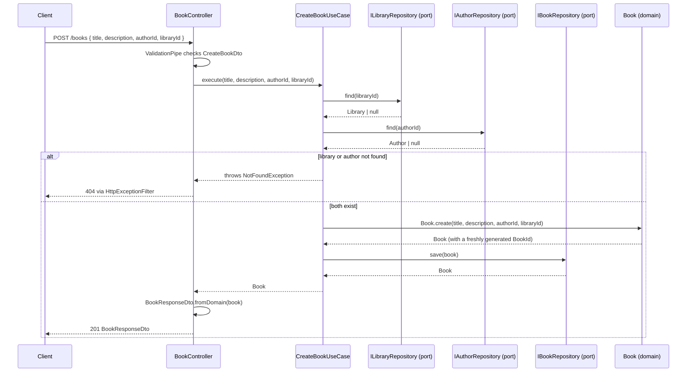

# nest-hexagonal — monolith branch

A [NestJS](https://nestjs.com) service that models a small library domain —
`Library`, `Author`, `Book` — as a **modular monolith** built with **Domain-Driven
Design (tactical patterns) + Hexagonal Architecture (Ports & Adapters)**,
following **Clean Architecture**'s dependency rule throughout.

This branch is one entry in a wider repository that compares the same
architectural discipline across different deployment topologies (see the
`main` branch for the map). Here, the topology is a single deployable
service; everything below explains what that looks like in practice and,
more importantly, *why* it's built this way.

## Why Hexagonal (Ports & Adapters)

The idea behind Hexagonal Architecture is simple to state and easy to get
wrong in practice: **the business logic shouldn't know how it's being
called, or what it's storing data in.** An HTTP request and a message off a
queue should be able to trigger the same use case without that use case
knowing which one happened. A Postgres table and an in-memory `Map` should
be swappable behind a repository without touching a single business rule.

The mechanism for that is **ports and adapters**:

- A **port** is an interface owned by the application layer, describing a
  capability it needs (`ILibraryRepository`) without saying how it's
  fulfilled.
- An **adapter** is a concrete implementation of that port, living in
  infrastructure (`InMemoryLibraryRepository` today; `PostgresLibraryRepository`
  /`MongoLibraryRepository` in the next phase). NestJS's DI container plugs
  the adapter into the port at runtime via an injection token — the use case
  never imports the adapter, only the interface.

Concretely in this codebase: every `application/interfaces/*.interface.ts`
file is a port, every `infrastructure/repositories/*.repository.ts` file is
an adapter, and the binding between them happens in exactly one place per
aggregate — that aggregate's `*.module.ts` `providers` array. Swapping
persistence technology later means writing a new adapter class and changing
one line in the module; it never means touching a use case.

## Why Clean Architecture (the Dependency Rule)

Hexagonal gives you the vocabulary (ports, adapters); Clean Architecture
gives you the rule for where things are *allowed* to depend on each other:

> Source code dependencies can only point inward. Nothing in an inner
> circle can know anything about something in an outer circle.

In this repo that's three concrete circles per aggregate:

```
infrastructure  →  application  →  domain
```

- **`domain`** (`entities/`, `valueObjects/`) is pure TypeScript. No NestJS
  decorators, no imports from `application` or `infrastructure`, nothing
  that couples it to a framework or a delivery mechanism. `Library.create()`
  works identically whether it's called from an HTTP controller, a test, or
  (hypothetically) a CLI.
- **`application`** (`interfaces/`, `useCases/`) depends only on `domain`
  and on the ports it defines — never on a concrete adapter, never on
  `express`/`Request`/`Response`.
- **`infrastructure`** (`presentation/`, `repositories/`) is where
  NestJS, HTTP, `class-validator`, and persistence-specific code are
  allowed to live, because this is the outermost, most replaceable layer.

This is why controllers map to/from DTOs at the boundary instead of passing
`Library` entities around — the moment a domain object crossed into
`infrastructure` and got serialized directly, `infrastructure` would start
dictating what `domain` needs to look like, and the dependency arrow would
effectively reverse.

## Aggregates and the bounded context

`Library`, `Author`, and `Book` all live in one bounded context — this is a
**modular monolith**, not three microservices wearing a trenchcoat. They
still keep aggregate boundaries: **an aggregate never holds a direct
reference to another aggregate's object, only its id.** `Book` holds
`libraryId: LibraryId` and `authorId: AuthorId`, never a `Library` or
`Author` instance.

Enforcing that reference-by-id rule when *creating* a `Book` — verifying the
referenced `Library` and `Author` actually exist — happens in
`CreateBookUseCase`, which injects `ILibraryRepository` and
`IAuthorRepository` directly. No anti-corruption layer, no event bus,
because it's all one bounded context; just a use case checking two ports
before it constructs the entity.

## How the pieces communicate

Here's the full `POST /books` flow end to end, which touches every layer
and both non-negotiable rules above (ports/adapters, and reference-by-id
cross-aggregate checks):



The controller and use case only ever talk to `LibPort`/`AuthPort`/`BookPort`
— the interfaces. Which concrete class answers `find()` or `save()`
(`InMemoryBookRepository` today) is decided once, in `book.module.ts`, and
is invisible to everything above this diagram.

## Package structure


Each aggregate module repeats this exact shape — `Domain` (`entities` +
`valueObjects`) at the center, `Application` (`interfaces` + `useCases`)
wrapped around it, `Infrastructure` (`repositories` + `presentation`) on
the outside — with `Tests` living alongside as its own top-level
compartment. This is the literal blueprint `library/`, `author/`, and
`book/` were built from; the arrow direction between the inner and outer
boxes is the same inward-pointing dependency rule described above.

## Domain model


This is the full target shape for all three aggregates — entities, Value
Objects, ports, use cases, and controllers are exactly what's implemented
today. The `Postgres*`/`Mongo*` repository classes on the diagram are the
next-phase adapters from the Roadmap below; right now each port is bound to
a single `InMemory*Repository` instead, behind the same interface.

## Target persistence schema


The repository ports are storage-agnostic by design — today they're backed
by in-memory `Map`s so the whole vertical slice runs without any external
dependency. This ER diagram is the relational shape they're headed toward
once the Postgres adapters land. One deliberate deviation from it:
primary/foreign keys here are typed `uuid`, not `int` — matching the
`LibraryId`/`AuthorId`/`BookId` Value Objects (`value: string`) and keeping
entity creation synchronous, since an auto-increment `int` id wouldn't
exist until after insert. `library_id`/`author_id` as foreign keys are
still the relational mirror of `Book`'s `LibraryId`/`AuthorId` Value
Objects — the "reference by id, not by object" rule holds at the database
level too.

## Where each concept lives

| Concept | Expressed as | Example |
| --- | --- | --- |
| Aggregate Root | A `domain/entities/*.entity.ts` class with a private constructor and static factories | `Library.create()` / `Library.reconstitute()` |
| Value Object | An immutable `domain/valueObjects/*.valueObject.ts` class — `get()`, no setters | `Address`, `LibraryId` |
| Port | An interface + DI token in `application/interfaces/*.interface.ts` | `ILibraryRepository` + `LIBRARY_REPOSITORY` |
| Use Case | One `application/useCases/*.useCase.ts` class, one `execute()` method | `CreateLibraryUseCase` |
| Adapter | A concrete class in `infrastructure/repositories/` implementing a port | `InMemoryLibraryRepository` |
| Boundary mapping | DTOs in `infrastructure/presentation/dto/`, translated in the controller only | `CreateLibraryDto` → `Library` → `LibraryResponseDto` |
| Composition root | Each aggregate's `providers` array, binding a port token to an adapter | `library.module.ts` |
| Cross-aggregate rule | A use case injecting another aggregate's port directly | `CreateBookUseCase` checking `ILibraryRepository`/`IAuthorRepository` |

See [CLAUDE.md](./CLAUDE.md) for the full folder layout, file-naming
convention, and the complete list of non-negotiable rules this table is
summarizing.

## Stack

- **NestJS 11** + TypeScript, built via the Nest CLI's **webpack** builder
  (needed for the `@modules`/`@utils`/`@schemas`/`@middlewares`/`@tests`
  path aliases to resolve at runtime, not just at type-check time).
- **Validation**: `class-validator` / `class-transformer`, enforced by a
  global `ValidationPipe` in `main.ts`.
- **Caching**: `@nestjs/cache-manager`, applied inside specific
  `Get...UseCase`s (single-entity lookups by id) rather than as a blanket
  HTTP interceptor — see [CLAUDE.md](./CLAUDE.md) for which use cases and
  why.
- **Errors**: use cases throw Nest's built-in HTTP exceptions directly; a
  single global `HttpExceptionFilter` normalizes all of them to one JSON
  shape.
- **Testing**: Jest, unit specs under `src/tests/<module>/*.test.ts`
  covering `domain` + `application` only (business logic — controllers and
  adapters are thin framework glue, not unit-tested directly).

## Getting started

```bash
npm install
cp .env.example .env   # adjust PORT and any other values
npm run start:dev      # http://localhost:3000 (or your configured PORT)
```

Try it end to end:

```bash
curl -X POST http://localhost:3000/libraries \
  -H "Content-Type: application/json" \
  -d '{"name":"Central Library","address":"123 Main St"}'
```

## Run tests

```bash
npm run test       # unit — domain + application layers
npm run test:cov   # unit, with coverage
npm run build       # webpack build (validates path aliases resolve)
npm run lint         # ESLint + Prettier
```

## Roadmap

This branch is deliberately mid-flight: the structural skeleton is
complete and runs end to end, but persistence is still an in-memory stand-in.
Next up, per [CLAUDE.md](./CLAUDE.md)'s non-negotiable rule 8:

- `Postgres<Aggregate>Repository` and `Mongo<Aggregate>Repository` adapters
  per aggregate, selected via config in each module — never inside a use
  case.
- Migrations for the schema shown above.
- A real cache backend (Redis) behind the same `CACHE_MANAGER` port already
  wired into the read use cases.

## Resources

- [NestJS Documentation](https://docs.nestjs.com)
- [NestJS Devtools](https://devtools.nestjs.com) — visualize your application graph and interact with it in real-time.

## License

Nest is [MIT licensed](https://github.com/nestjs/nest/blob/master/LICENSE).
